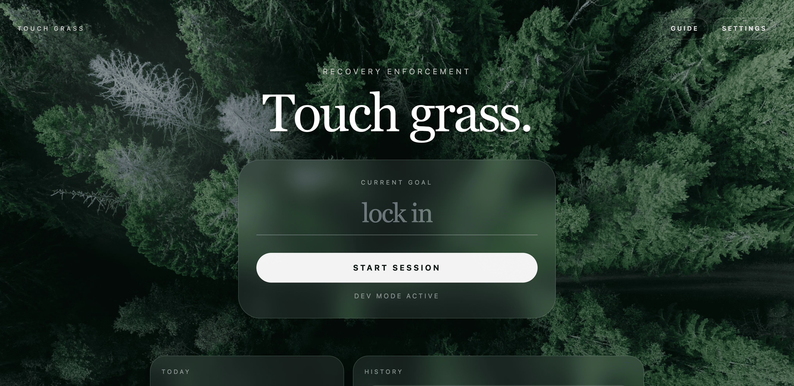

# Touch Grass

<p align="center">
  
</p>

Touch Grass is an open source Chrome extension for enforced recovery during deep work sessions. It replaces the new tab page with a session dashboard, uses `chrome.alarms` to drive a strict work/break state machine, and injects a fullscreen overlay across tabs during breaks and shutdown windows so the lock, not the timer, is the core behavior.

## Install

Chrome Web Store: Not available yet.

## Tech stack

- TypeScript with strict mode
- Vite for bundling multiple extension entry points
- Chrome Extension Manifest V3
- Tailwind CSS bundled locally through Vite
- HTML/CSS for the new tab page, settings page, and overlay UI
- Chrome APIs: `chrome.alarms`, `chrome.offscreen`, `chrome.storage.local`, `chrome.tabs`, `chrome.scripting`, `chrome.action`

## Project structure

```text
.
├── public/
│   ├── manifest.json                # MV3 manifest copied directly into dist/
│   └── sounds/
│       ├── session-start-1.mp3      # Session start sound variant
│       ├── session-start-2.mp3      # Session start sound variant
│       ├── break-start.mp3          # Placeholder local sound asset for break start
│       ├── fah.mp3                  # Break complete sound variant
│       ├── sus-meme-sound.mp3       # Break complete sound variant
│       └── shutdown.mp3             # Placeholder local sound asset for shutdown
├── src/
│   ├── background/
│   │   └── service-worker.ts        # State machine, alarms, tab injection, runtime message hub
│   ├── newtab/
│   │   ├── index.html               # Chrome new tab override entry HTML
│   │   ├── newtab.ts                # Dashboard rendering, onboarding, session controls, local lock UI
│   │   └── newtab.css               # Dashboard styling and Tailwind import
│   ├── offscreen/
│   │   ├── index.html               # Offscreen document entry for audio and badge updates
│   │   └── offscreen.ts             # Managed audio playback and badge countdown sync
│   ├── overlay/
│   │   ├── overlay.ts               # Injected blocker UI for break/shutdown across tabs
│   │   └── overlay.css              # Chaotic and calm overlay styles
│   ├── settings/
│   │   ├── index.html               # Extension settings page entry HTML
│   │   ├── settings.ts              # Settings form logic, onboarding completion, and local lock UI
│   │   └── settings.css             # Settings page styling and Tailwind import
│   ├── types/
│   │   └── index.ts                 # Shared app state, overlay payload, and runtime message types
│   ├── utils/
│   │   ├── storage.ts               # Typed chrome.storage.local wrappers and state normalization
│   │   └── time.ts                  # Shared time parsing and formatting helpers
│   └── config.ts                    # Shared constants, default settings, DEV_MODE flag
├── .gitignore
├── package.json
├── README.md
├── tsconfig.json
└── vite.config.ts
```

## Setup instructions

1. Clone the repository.
2. Open a terminal in the project root.
3. Install dependencies:

```bash
npm install
```

4. Build the extension once:

```bash
npm run build
```

5. Confirm a `dist/` folder was created. That folder is what Chrome loads.

## How to load the extension in Chrome for the first time

1. Run:

```bash
npm run build
```

2. Open `chrome://extensions`.
3. Turn on **Developer mode** in the top right.
4. Click **Load unpacked**.
5. Select the project’s `dist/` folder.
6. Open a new tab. You should see the Touch Grass dashboard instead of Chrome’s default new tab page.

## How to test during development

1. Start a watch build:

```bash
npm run dev
```

2. Keep `chrome://extensions` open in another tab.
3. After code changes, click the extension’s **Reload** button in `chrome://extensions`.
4. Refresh the extension page you are testing:
   - New tab page: open a fresh tab or reload the existing new tab
   - Settings page: refresh the page
   - Overlay script: reload the target site tab, then trigger a break again

### DEV_MODE

- Open `src/config.ts`.
- Set `DEV_MODE` to `true` when you want the fast development timings.
- Rebuild with `npm run build` or let `npm run dev` rebuild automatically.
- Reload the unpacked extension in Chrome.

When `DEV_MODE` is `true`:

- Work duration becomes 10 seconds
- Break duration becomes 10 seconds
- State transitions log to the service worker console
- Break overlays show a visible `DEV BYPASS — skip break` button
- Shutdown overlays can be dismissed instantly through the same bypass path

### How to inspect the service worker

1. Open `chrome://extensions`.
2. Find the Touch Grass extension card.
3. Click the **service worker** link.
4. Use that DevTools window to watch logs, alarms, errors, and runtime messages.

### How to debug the new tab page

1. Open a new tab.
2. Right-click the page.
3. Click **Inspect**.
4. Use the Elements, Console, and Network panels like a normal webpage.

### How to debug injected overlay scripts

1. Open any normal website tab, not `chrome://` pages.
2. Trigger a break.
3. Open DevTools for that tab.
4. Inspect the injected DOM node with id `touch-grass-overlay-root`.
5. Check the Console for content-script-side errors, especially sound file loading issues.

## How to add sounds

Drop your audio files into `public/sounds/` and keep the filenames referenced in `src/config.ts`:

- `public/sounds/session-start-1.mp3`
- `public/sounds/session-start-2.mp3`
- `public/sounds/let-him-cook.mp3`
- `public/sounds/break-start.mp3`
- `public/sounds/lofi-beats/chill-lofi-hip-hop.mp3`
- `public/sounds/fah.mp3`
- `public/sounds/sus-meme-sound.mp3`
- `public/sounds/shutdown.mp3`

The code resolves these through `chrome.runtime.getURL()` and the offscreen document plays them on demand. Missing or invalid files fail quietly enough that local UI work is still possible, but audio-related behavior should be tested with real assets present.

## State machine

The extension models recovery explicitly:

```text
IDLE -> WORKING -> BREAK -> CHECK_IN -> WORKING -> ... -> SHUTDOWN -> IDLE
             \-> PAUSED -> WORKING
```

- `IDLE`: no active work session
- `WORKING`: a work interval is in progress
- `PAUSED`: a work interval is paused locally and can be resumed
- `BREAK`: the break overlay is active across tabs
- `CHECK_IN`: the break ended and the user must decide whether to resume or stop
- `SHUTDOWN`: the browser is locked until the next configured work start time

All state is stored in `chrome.storage.local` under a single typed key so it survives browser restarts.

## Known Chrome extension gotchas

1. Manifest V3 service workers sleep aggressively. Do not rely on in-memory variables surviving forever.
2. `setTimeout` and `setInterval` are not reliable for extension lifecycle timing. Use `chrome.alarms` for transitions that must survive sleeping, tab closes, or browser restarts.
3. You cannot inject scripts into every page. `chrome://`, the Chrome Web Store, and some privileged pages are off-limits.
4. MV3 Content Security Policy is strict. Remote script CDNs are effectively a non-starter for production extension pages.
5. `localStorage` belongs to individual pages. `chrome.storage.local` is the right persistence layer for shared extension state.
6. Content scripts run in an isolated world, not directly in the page’s JS context. DOM access works, but JS globals from the page are not shared.
7. Reloading an unpacked extension restarts the service worker. Always retest alarm scheduling and state restoration after reloads.
8. Long-running overlays need reinjection for newly loaded tabs. That is why the service worker listens to `tabs.onUpdated`.

## Contributing

Contributions are welcome. Please read [CONTRIBUTING.md](CONTRIBUTING.md)
before submitting a pull request and note that this project follows a
[Code of Conduct](CODE_OF_CONDUCT.md).

## Notes

- This project intentionally bundles Tailwind locally instead because MV3 CSP and the offline requirement make CDN runtime loading a bad fit.
- Chrome alarm timing is the source of truth. UI countdowns can use lightweight intervals for display only, but state transitions always come from alarms.
- The current project is intentionally backend-free. Everything runs locally inside the browser.
